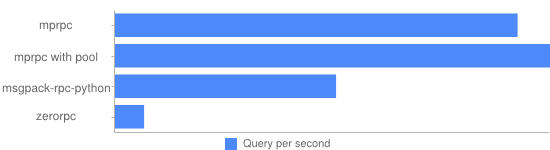

Performance
===========

mprpc significantly outperforms the `official MessagePack RPC <https://github.com/msgpack-rpc/msgpack-rpc-python>`_ (**1.8x** faster), which is built using `Facebook's Tornado <http://www.tornadoweb.org/en/stable/>`_ and `MessagePack <http://msgpack.org/>`_, and `ZeroRPC <http://zerorpc.dotcloud.com/>`_ (**14x** faster), which is built using `ZeroMQ <http://zeromq.org/>`_ and `MessagePack <http://msgpack.org/>`_.

Results
-------

mprpc
^^^^^

.. code-block:: bash

    % python benchmarks/benchmark.py
    call: 9061 qps
    call_using_connection_pool: 9790 qps

Official MesssagePack RPC
^^^^^^^^^^^^^^^^^^^^^^^^^

.. code-block:: bash

    % pip install msgpack-rpc-python
    % python benchmarks/benchmark_msgpackrpc_official.py
    call: 4976 qps

ZeroRPC
^^^^^^^

.. code-block:: bash

    % pip install zerorpc
    % python benchmarks/benchmark_zerorpc.py
    call: 655 qps

Environment
-----------

- OS: Mac OS X 10.8.5
- CPU: Intel Core i7 2GHz
- Memory: 8GB
- Python: 2.7.3
